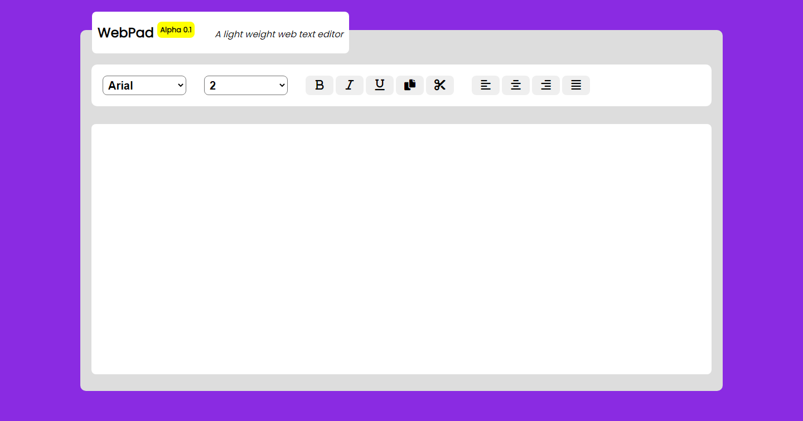

# WebPad text editor (Beta)
## Developer: Mahmood Hassan Rameem
## _Studing Diploma Engineering_
## _Computer Technology_

___

<br>

### My website:
```
https://rameem2003.github.io/rameem.me
```

<br>

### To visit this site: 
```
https://rameem2003.github.io/text_editor/

```

# Webpage interface


## Task List

- [x] HTML
- [x] CSS
- [x] Google Font
- [x] Font Awesome
- [x] JavaScript
---


## Feature's

- [x] Font family edit
- [x] Font size edit
- [x] Bold, italic, underline button
- [x] Left, right, center, justify alignment button
- [x] Cut, copy button

# This is me

## Keep code :)
